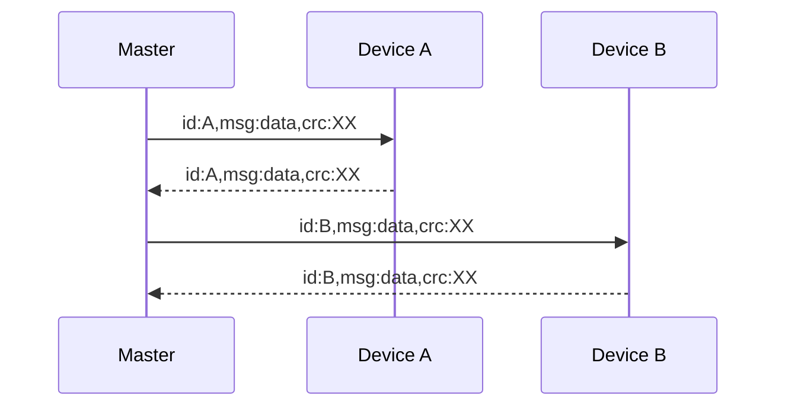

# Protocol Majordomus Rs-485 ASCII
This document describes the communication protocol between Majordomus devices and Main computer. The communication is based on RS-485 physical layer. 
|Serial settings| value|
|--|--|
| Baud rate | 115 200 kbps|
| Data bits | 8 |
| Stop bits | 1 |
| Parity | None |

On the bus is one master computer and the master requests data from all devices. The device sends no data without previous request.
Every Device has `id` string with maximum length of 32 characters.

## Generic message format for all devices
- Message starts with `id:deviceName`. 
- Message ends with `CR LF` characters.
- Message has properties separed by `,` and one property has format `key:value`.
- Last property is `crc`. [CRC Calculation](#crc-calculation)

### Example 1 - Read device status
Main computer sends message to request status from device `test`:
 `id:test,msg:status,crc:8b\r\n`
 Response from device (FW version, power voltages):
`id:test,type:RoomSens,version:0.3(Nov  2 2024),pwr:12.05,pwrOut:12.11,crc:f0`

 ### Example 2 - Read device data
Main computer sends message to request from device `test` data:
 `id:test,msg:data,crc:ea`
 Response from device (digital inputs, temperatures, humidity, etc.. ):
`id:test,di:0,btn:0,t:210,t2:211,rh:540,mo:0,voc:95,lux:569,nl:278,adc0:0.00,adc1:0.00,crc:22`

 ### Example 3 - Read and write device data
Main computer sends message to request from device `test` data and write data to device (digital outputs, DAC, led light etc.. ):
 `id:test,msg:data,do:3,dac0:5.4,dac1:1.2,light:1,reqT:225,crc:93`
 Response from device (digital inputs, temperatures, humidity, etc.. ):
`id:test,di:0,btn:0,t:210,t2:211,rh:540,mo:0,voc:95,lux:569,nl:278,adc0:0.00,adc1:0.00,crc:22`

### Example 4 - Change device id
Main computer sends config message to device `test` to change id to `test2`.
 `id:test,msg:config,newId:test2,crc:ea`

### Example 5 - Restart device
Main computer sends config message to device `test` to restart
 `id:test,msg:config,cmd:reset,crc:07`

> If you don't know device `id`, you can replace `deviceName` with string `all`. So the message is for all devices on the bus. In this case respond all devices for the request. To prevent bus colision on RS-485 every device add random delay before start sending response. This fetature is not recomended for normal operation.

## RoomIO
### Status message
| From RoomIO| Note|
|--|--|
| type | type of device (RoomIO) |
| version | FW version X.Y (Build date) |
| pwr | Power voltage in volts |
| pwrOut | Power voltage in volts after fuse for digital outputs and inputs |
### Config message
| To RoomIO| Note|
|--|--|
| newId | Change id to new string (max 32 characters) |
| newId5050| The same as newID, but the commands will executed with 50:50 propability (depends on random generator on device). This command can be helpful when we have two same id on the bus|
| reset| Restart the device |

### Data message
| From RoomIO| Note|
|--|--|
| adc0  | Analog input voltage |
| adc1  | Analog input voltage |
| di  | Digital inputs bit array |
| btn | Digital buttons bit array. Sends only once rising edges. |
| t0| Temperature in °C |
| t1| Temperature in °C |

| To RoomIO| note|
|--|--|
| dac0 | Set Digital to Analog voltage |
| dac1 | Set Digital to Analog voltage |
| do | Set digital outputs bit array |

## RoomSensor

## TinySensor

### CRC calculation

    static unsigned char const crc8_table[] = {
	    0xea, 0xd4, 0x96, 0xa8, 0x12, 0x2c, 0x6e, 0x50, 0x7f, 0x41, 0x03, 0x3d,
	    0x87, 0xb9, 0xfb, 0xc5, 0xa5, 0x9b, 0xd9, 0xe7, 0x5d, 0x63, 0x21, 0x1f,
	    0x30, 0x0e, 0x4c, 0x72, 0xc8, 0xf6, 0xb4, 0x8a, 0x74, 0x4a, 0x08, 0x36,
	    0x8c, 0xb2, 0xf0, 0xce, 0xe1, 0xdf, 0x9d, 0xa3, 0x19, 0x27, 0x65, 0x5b,
	    0x3b, 0x05, 0x47, 0x79, 0xc3, 0xfd, 0xbf, 0x81, 0xae, 0x90, 0xd2, 0xec,
	    0x56, 0x68, 0x2a, 0x14, 0xb3, 0x8d, 0xcf, 0xf1, 0x4b, 0x75, 0x37, 0x09,
	    0x26, 0x18, 0x5a, 0x64, 0xde, 0xe0, 0xa2, 0x9c, 0xfc, 0xc2, 0x80, 0xbe,
	    0x04, 0x3a, 0x78, 0x46, 0x69, 0x57, 0x15, 0x2b, 0x91, 0xaf, 0xed, 0xd3,
	    0x2d, 0x13, 0x51, 0x6f, 0xd5, 0xeb, 0xa9, 0x97, 0xb8, 0x86, 0xc4, 0xfa,
	    0x40, 0x7e, 0x3c, 0x02, 0x62, 0x5c, 0x1e, 0x20, 0x9a, 0xa4, 0xe6, 0xd8,
	    0xf7, 0xc9, 0x8b, 0xb5, 0x0f, 0x31, 0x73, 0x4d, 0x58, 0x66, 0x24, 0x1a,
	    0xa0, 0x9e, 0xdc, 0xe2, 0xcd, 0xf3, 0xb1, 0x8f, 0x35, 0x0b, 0x49, 0x77,
	    0x17, 0x29, 0x6b, 0x55, 0xef, 0xd1, 0x93, 0xad, 0x82, 0xbc, 0xfe, 0xc0,
	    0x7a, 0x44, 0x06, 0x38, 0xc6, 0xf8, 0xba, 0x84, 0x3e, 0x00, 0x42, 0x7c,
	    0x53, 0x6d, 0x2f, 0x11, 0xab, 0x95, 0xd7, 0xe9, 0x89, 0xb7, 0xf5, 0xcb,
	    0x71, 0x4f, 0x0d, 0x33, 0x1c, 0x22, 0x60, 0x5e, 0xe4, 0xda, 0x98, 0xa6,
	    0x01, 0x3f, 0x7d, 0x43, 0xf9, 0xc7, 0x85, 0xbb, 0x94, 0xaa, 0xe8, 0xd6,
	    0x6c, 0x52, 0x10, 0x2e, 0x4e, 0x70, 0x32, 0x0c, 0xb6, 0x88, 0xca, 0xf4,
	    0xdb, 0xe5, 0xa7, 0x99, 0x23, 0x1d, 0x5f, 0x61, 0x9f, 0xa1, 0xe3, 0xdd,
	    0x67, 0x59, 0x1b, 0x25, 0x0a, 0x34, 0x76, 0x48, 0xf2, 0xcc, 0x8e, 0xb0,
	    0xd0, 0xee, 0xac, 0x92, 0x28, 0x16, 0x54, 0x6a, 0x45, 0x7b, 0x39, 0x07,
	    0xbd, 0x83, 0xc1, 0xff};
	    
	uint8_t crc8(uint8_t seed = 0, unsigned char const *data, size_t len)
	{
		uint8_t crc = seed;
		if (data == NULL)
	        return 0;
	    crc &= 0xff;
	    unsigned char const *end = data + len;
	    while (data < end)
	        crc = crc8_table[crc ^ *data++];
	    return crc;
	}

