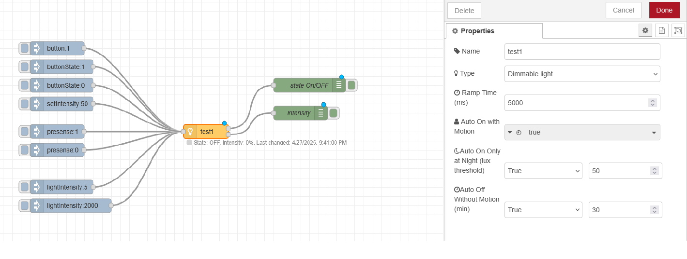
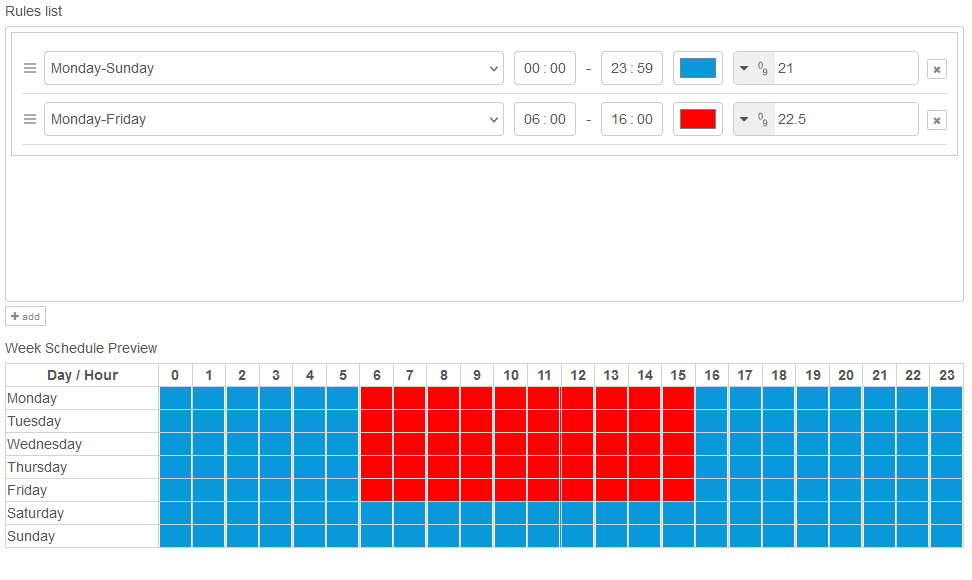

# Majordomus for node-red

## Light

The Light node allows control your light with buttons, presense senor and luxmeter. The node supports ON/OFF or dimmable light.

### Features
- Control with buttons (toggle output)
- Automatic turn on the light on motion
- Automatic on only in night based on luxmeter
- Automatic turn off the light after no presense timeout
- Fade in and fade out for dimmable lights

## Scheduler

The Scheduler node allows you to configure time-based rules to control your application.

### Features
- Define rules for specific days or day ranges.
- Set start and end times for each rule.
- Assign a value to output during active periods.
- Visualize rules in a weekly schedule preview.

### Configuration Options

### Name
Specify a unique name for the node.

### Rules List
Manage a list of time-based rules:
- **Day Range**: Select specific days or day ranges (e.g., Monday-Sunday).
- **Start Time**: Define when the rule becomes active.
- **End Time**: Define when the rule becomes inactive.
- **Value**: Set the value to output during the active period.
- **Color**: Assign a color to visualize the rule in the preview table.

### Outputs
The node outputs a value defined in the rules when the current time falls within a rule's active period.

##### Examples

### Workday Schedule
- **Day Range**: Monday-Friday
- **Time**: 09:00 - 17:00
- **Output Value**: "Working Hours"

### Weekend Relaxation
- **Day Range**: Saturday-Sunday
- **Time**: 10:00 - 22:00
- **Output Value**: "Relaxing"

### Status Indicators
- **Green dot**: Indicates an active rule is being executed.
- **Gray ring**: No active rules match the current time.

## More Information
Visit the [project's GitHub repository](https://github.com/jirihusak/majordomus) or (https://www.majordomus.tech)

