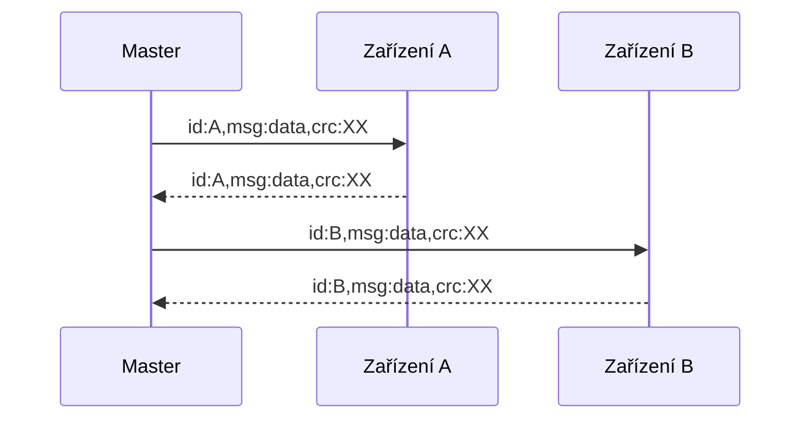

# Protokol RS-485

Referenční popis komunikace mezi jednotkami Majordomus a řídícím počítačem po sběrnici RS-485. Jednotky podporují dva protokoly:

- **ASCII protokol** — nativní protokol systému Majordomus, používá ho Majordomus Control
- **Modbus RTU** — standardní průmyslový protokol pro integraci s PLC a SCADA systémy

Anglické originály: [ASCII protokol](https://github.com/jirihusak/majordomus/blob/main/HW/Protocol%20Majordomus%20Rs-485%20ASCII.md) · [Modbus](https://github.com/jirihusak/majordomus/blob/main/HW/Protocol%20Majordomus%20Modbus.md)

---

## Parametry sériové linky

| Parametr | Hodnota |
|---|---|
| Rychlost | 115 200 bps |
| Datové bity | 8 |
| Stop bity | 1 |
| Parita | žádná |

Na sběrnici je jeden **master** (řídící počítač) — jednotky nikdy nevysílají samy od sebe, pouze odpovídají na dotaz. Každé zařízení má textové `id` o maximální délce 32 znaků.



---

## ASCII protokol

### Formát zprávy

- Zpráva začíná `id:<název_zařízení>`.
- Končí znaky `CR LF`.
- Vlastnosti jsou odděleny čárkou, každá má formát `klíč:hodnota`.
- Poslední vlastností je vždy `crc` — [výpočet níže](#vypocet-crc).

### Příklady

**Čtení stavu zařízení** (verze FW, napájecí napětí):

```
→  id:test,msg:status,crc:8b\r\n
←  id:test,type:RoomSens,version:0.3(Nov  2 2024),pwr:12.05,pwrOut:12.11,crc:f0
```

**Čtení dat:**

```
→  id:test,msg:data,crc:ea
←  id:test,di:0,btn:0,t:210,t2:211,rh:540,mo:0,voc:95,lux:569,nl:278,adc0:0.00,adc1:0.00,crc:22
```

**Čtení a zápis v jedné zprávě** (digitální výstupy, DAC, přísvit, žádaná teplota):

```
→  id:test,msg:data,do:3,dac0:5.4,dac1:1.2,light:1,reqT:225,crc:93
←  id:test,di:0,btn:0,t:210,t2:211,rh:540,mo:0,voc:95,lux:569,nl:278,adc0:0.00,adc1:0.00,crc:22
```

**Změna id zařízení:**

```
→  id:test,msg:config,newId:test2,crc:ea
```

**Restart zařízení:**

```
→  id:test,msg:config,cmd:reset,crc:07
```

!!! tip "Neznám id zařízení"
    Místo názvu zařízení lze použít `all` — zprávu pak zpracují všechna zařízení na sběrnici. Aby nedošlo ke kolizi, každé zařízení před odpovědí čeká náhodnou dobu. Pro běžný provoz se to nedoporučuje, hodí se pro prvotní zjištění zařízení na lince.

### Zpráva `status`

```
id:<zařízení>,msg:status,...
```

| Odpověď | Význam |
|---|---|
| `type` | Typ zařízení (např. `RoomSens`) |
| `version` | Verze FW: `X.Y (datum sestavení)` |
| `pwr` | Napájecí napětí ve voltech |
| `pwrOut` | Napájecí napětí za pojistkou vstupů/výstupů |

### Zpráva `config`

```
id:<zařízení>,msg:config,...
```

| Klíč | Význam |
|---|---|
| `newId` | Změna id na nový řetězec (max. 32 znaků) |
| `newId5050` | Jako `newId`, ale zařízení příkaz provede s pravděpodobností 50 % — řeší situaci, kdy mají dvě zařízení na sběrnici stejné id |
| `cmd:reset` | Restart zařízení |

### Zpráva `data` — RoomIO

| Ze zařízení | Význam |
|---|---|
| `adc0`, `adc1` | Napětí analogových vstupů |
| `di` | Bitové pole digitálních vstupů |
| `btn` | Bitové pole tlačítek — posílá se jednou při náběžné hraně |
| `t0`, `t1` | Teploty z 1-Wire senzorů (°C) |

| Do zařízení | Význam |
|---|---|
| `dac0`, `dac1` | Nastavení analogových výstupů |
| `do` | Bitové pole digitálních výstupů (bit 0 = výstup 0, ...) |

### Zpráva `data` — RoomSensor

| Ze zařízení | Význam |
|---|---|
| `adc0`, `adc1` | Napětí analogových vstupů |
| `di` | Bitové pole digitálních vstupů |
| `btn` | Bitové pole tlačítek — posílá se jednou při náběžné hraně |
| `t0` | Teplota z předního krytu (°C) |
| `t1` | Teplota ze senzoru vlhkosti (°C) |
| `t2`, `t3` | Teploty z 1-Wire senzorů (°C) |
| `rh` | Relativní vlhkost (%) |
| `mo` | PIR detektor pohybu (`0`/`1`) |
| `voc` | Kvalita vzduchu VOC (0–500) |
| `lux` | Intenzita osvětlení (lux) |
| `nl` | Hladina hluku (dB) |
| `newReqT` | Nová žádaná teplota zadaná uživatelem na displeji — posílá se jednou při potvrzení |

| Do zařízení | Význam |
|---|---|
| `dac0`, `dac1` | Nastavení analogových výstupů |
| `do` | Bitové pole digitálních výstupů |
| `reqT` | Žádaná teplota zobrazená na LCD |
| `beep` | Spuštění pípání (0–4) |
| `light` | Ovládání LED přísvitu (`0`/`1`) |

### Zpráva `data` — TinySensor

| Ze zařízení | Význam |
|---|---|
| `di` | Bitové pole digitálních vstupů |
| `btn` | Bitové pole tlačítek |
| `t0` | Teplota (°C) |
| `rh` | Relativní vlhkost (%) |
| `t1`, `t2` | Teploty z 1-Wire senzorů (°C) |

| Do zařízení | Význam |
|---|---|
| `do` | Bitové pole digitálních výstupů |

!!! note "Formát číselných hodnot"
    Teploty a vlhkost se po sběrnici posílají jako celá čísla ×10 — např. `t:210` znamená 21,0 °C, `rh:540` znamená 54,0 %.

### Výpočet CRC

Kontrolní součet je CRC-8 počítaný tabulkou z celé zprávy před vlastností `crc`:

```c
static unsigned char const crc8_table[] = {
    0xea, 0xd4, 0x96, 0xa8, 0x12, 0x2c, 0x6e, 0x50, 0x7f, 0x41, 0x03, 0x3d,
    0x87, 0xb9, 0xfb, 0xc5, 0xa5, 0x9b, 0xd9, 0xe7, 0x5d, 0x63, 0x21, 0x1f,
    0x30, 0x0e, 0x4c, 0x72, 0xc8, 0xf6, 0xb4, 0x8a, 0x74, 0x4a, 0x08, 0x36,
    0x8c, 0xb2, 0xf0, 0xce, 0xe1, 0xdf, 0x9d, 0xa3, 0x19, 0x27, 0x65, 0x5b,
    0x3b, 0x05, 0x47, 0x79, 0xc3, 0xfd, 0xbf, 0x81, 0xae, 0x90, 0xd2, 0xec,
    0x56, 0x68, 0x2a, 0x14, 0xb3, 0x8d, 0xcf, 0xf1, 0x4b, 0x75, 0x37, 0x09,
    0x26, 0x18, 0x5a, 0x64, 0xde, 0xe0, 0xa2, 0x9c, 0xfc, 0xc2, 0x80, 0xbe,
    0x04, 0x3a, 0x78, 0x46, 0x69, 0x57, 0x15, 0x2b, 0x91, 0xaf, 0xed, 0xd3,
    0x2d, 0x13, 0x51, 0x6f, 0xd5, 0xeb, 0xa9, 0x97, 0xb8, 0x86, 0xc4, 0xfa,
    0x40, 0x7e, 0x3c, 0x02, 0x62, 0x5c, 0x1e, 0x20, 0x9a, 0xa4, 0xe6, 0xd8,
    0xf7, 0xc9, 0x8b, 0xb5, 0x0f, 0x31, 0x73, 0x4d, 0x58, 0x66, 0x24, 0x1a,
    0xa0, 0x9e, 0xdc, 0xe2, 0xcd, 0xf3, 0xb1, 0x8f, 0x35, 0x0b, 0x49, 0x77,
    0x17, 0x29, 0x6b, 0x55, 0xef, 0xd1, 0x93, 0xad, 0x82, 0xbc, 0xfe, 0xc0,
    0x7a, 0x44, 0x06, 0x38, 0xc6, 0xf8, 0xba, 0x84, 0x3e, 0x00, 0x42, 0x7c,
    0x53, 0x6d, 0x2f, 0x11, 0xab, 0x95, 0xd7, 0xe9, 0x89, 0xb7, 0xf5, 0xcb,
    0x71, 0x4f, 0x0d, 0x33, 0x1c, 0x22, 0x60, 0x5e, 0xe4, 0xda, 0x98, 0xa6,
    0x01, 0x3f, 0x7d, 0x43, 0xf9, 0xc7, 0x85, 0xbb, 0x94, 0xaa, 0xe8, 0xd6,
    0x6c, 0x52, 0x10, 0x2e, 0x4e, 0x70, 0x32, 0x0c, 0xb6, 0x88, 0xca, 0xf4,
    0xdb, 0xe5, 0xa7, 0x99, 0x23, 0x1d, 0x5f, 0x61, 0x9f, 0xa1, 0xe3, 0xdd,
    0x67, 0x59, 0x1b, 0x25, 0x0a, 0x34, 0x76, 0x48, 0xf2, 0xcc, 0x8e, 0xb0,
    0xd0, 0xee, 0xac, 0x92, 0x28, 0x16, 0x54, 0x6a, 0x45, 0x7b, 0x39, 0x07,
    0xbd, 0x83, 0xc1, 0xff};

uint8_t crc8(uint8_t seed, unsigned char const *data, size_t len)
{
    uint8_t crc = seed;
    if (data == NULL)
        return 0;
    crc &= 0xff;
    unsigned char const *end = data + len;
    while (data < end)
        crc = crc8_table[crc ^ *data++];
    return crc;
}
```

---

## Modbus

Jednotky podporují i standardní protokol **Modbus RTU** se stejnými parametry sériové linky. Každé zařízení má Modbus adresu 1–247.

### Registry — RoomSensor

| Logická adresa | Registr | Přístup | Velikost | Typ | Význam |
|--|--|--|--|--|--|
| 0x41001 | 0x1000 | čtení | 2 B | INT16 | Teplota z předního krytu [×10 °C] |
| 0x41002 | 0x1001 | čtení | 2 B | INT16 | Teplota ze senzoru vlhkosti [×10 °C] |
| 0x41003 | 0x1002 | čtení | 2 B | UINT16 | Relativní vlhkost [×10 %] |
| 0x41004 | 0x1003 | čtení | 2 B | INT16 | Teplota z 1-Wire senzoru 0 [×10 °C] |
| 0x41005 | 0x1004 | čtení | 2 B | INT16 | Teplota z 1-Wire senzoru 1 [×10 °C] |
| 0x41006 | 0x1005 | čtení | 2 B | UINT16 | Kvalita vzduchu VOC index [0–500] |
| 0x41007 | 0x1006 | čtení | 2 B | UINT16 | CO₂ [ppm] |
| 0x41008 | 0x1007 | čtení | 4 B | UINT32 | Intenzita osvětlení [lux] |
| 0x4100A | 0x1009 | čtení | 2 B | UINT16 | Hladina hluku [dB] |
| 0x4100B | 0x100A | čtení | 2 B | UINT16 | PIR detektor pohybu [0/1] |
| 0x4100C | 0x100B | čtení | 2 B | UINT16 | Bitové pole digitálních vstupů |
| 0x4100D | 0x100C | čtení | 2 B | UINT16 | Bitové pole tlačítek (náběžná hrana) |
| 0x4100E | 0x100D | čtení | 2 B | UINT16 | ADC0 — napětí analogového vstupu [mV] |
| 0x4100F | 0x100E | čtení | 2 B | UINT16 | ADC1 — napětí analogového vstupu [mV] |
| 0x41010 | 0x100F | čtení | 2 B | UINT16 | Napájecí napětí [mV] |
| 0x41011 | 0x1010 | čtení | 2 B | UINT16 | Napájecí napětí výstupů [mV] |
| 0x62001 | 0x2000 | zápis | 2 B | UINT16 | Bitové pole digitálních výstupů |
| 0x62002 | 0x2001 | zápis | 2 B | UINT16 | DAC0 — analogový výstup [mV] |
| 0x62003 | 0x2002 | zápis | 2 B | UINT16 | DAC1 — analogový výstup [mV] |
| 0x62004 | 0x2003 | zápis | 2 B | UINT16 | Pípák [0–4] |
| 0x62005 | 0x2004 | zápis | 2 B | UINT16 | LED přísvit [0/1] |
| 0x62006 | 0x2005 | zápis | 2 B | INT16 | Žádaná teplota na LCD [×10 °C] |
