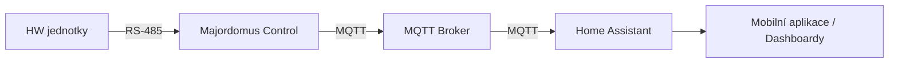

# Home Assistant

## Co je Home Assistant?

Home Assistant je nejpopulárnější open-source platforma pro chytrou domácnost na světě. Běží lokálně u vás doma, funguje bez cloudu a podporuje **tisíce integrací** — od světel a termostatů přes televize a fotovoltaiku až po elektromobily.

Kolem Home Assistantu existuje obrovská komunita: pravidelné měsíční aktualizace, tisíce návodů a doplňků a aktivní fóra, kde najdete řešení téměř na cokoliv.

Home Assistant je open-source a zcela zdarma → [home-assistant.io](https://www.home-assistant.io/)

---

## Proč Home Assistant v chytrém domě?

V rámci chytré domácnosti slouží Home Assistant především jako **uživatelské rozhraní celého domu**:

- **Dashboardy** — přehled celého domu na jedné obrazovce: teploty, spotřeba, stav světel, žaluzií a topení.
- **Mobilní aplikace** — ovládání domu odkudkoliv, notifikace na mobil (pro Android i iOS).
- **Hlasové ovládání** — propojení s hlasovými asistenty.
- **Integrace třetích stran** — televize, fotovoltaika, elektromobil, meteostanice, chytré spotřebiče a stovky dalších zařízení mimo Majordomus.
- **Historie a grafy** — automatické ukládání a vizualizace dat ze všech senzorů.

---

## Home Assistant a Majordomus

V systému Majordomus má každý nástroj svou roli:

- **Majordomus Control** zajišťuje spolehlivý sběr a řízení dat na úrovni hardwaru (RS-485 → MQTT).
- **Node-RED** zpracovává kritickou logiku domu — topení, osvětlení, žaluzie.
- **Home Assistant** je výkladní skříň celého systému — dashboardy, mobilní aplikace a integrace s okolním světem.

!!! tip "Auto-discovery — zařízení se objeví sama"
    Majordomus Control podporuje **MQTT auto-discovery**. Všechny senzory, spínače a další zařízení Majordomus se v Home Assistantu objeví automaticky — bez ruční konfigurace, bez psaní YAML souborů.

Home Assistant přitom není podmínkou — systém Majordomus funguje i bez něj. Pokud vám stačí Node-RED a jeho dashboard, Home Assistant instalovat nemusíte. Většina uživatelů ale ocení jeho mobilní aplikaci a snadnou tvorbu přehledných dashboardů.
