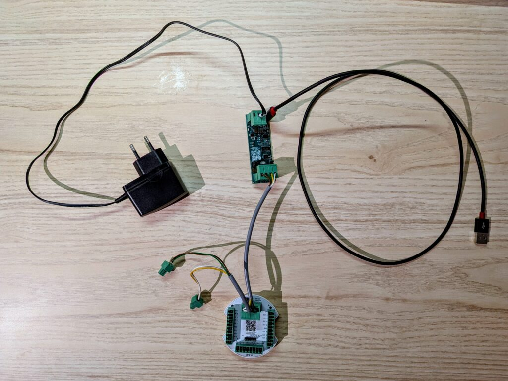

# Co potřebuji pro start

Majordomus je navržen tak, aby ho zvládl zprovoznit i nadšenec bez hlubokých znalostí elektroniky nebo programování. Přesto je dobré vědět, jaké základní vybavení budete potřebovat.

---

## Minimální hardware

Pro první spuštění a vyzkoušení systému vám stačí:

- **Řídící jednotka** — například Raspberry Pi 4 nebo jakýkoliv mini PC s Linuxem. Pro první test postačí i běžný stolní počítač nebo notebook.
- **[Převodník USB → RS-485](https://majordomus.tech/rs485-2-usb/)** — propojuje řídící jednotku se sběrnicí Majordomus.
- **Modul Majordomus** — pro test stačí jeden kus [RoomIO](https://majordomus.tech/roomio/) nebo [RoomSensor](https://majordomus.tech/roomsensor/).
- **Napájecí zdroj** — 12 V DC (systém akceptuje rozsah 7–27 V DC).
- **Propojovací kabel** — běžný UTP kabel (Cat5e nebo Cat6) pro napájení a komunikaci.
- **Volitelně pro testování** — tlačítka, 12V LED indikátory, senzory apod.

!!! tip "Chci to jen vyzkoušet"
    Nepotřebujete hned kupovat Raspberry Pi ani tahat kabely po domě. Stačí notebook, USB převodník, jeden modul a kus UTP kabelu na stole — a za pár minut máte funkční systém, se kterým si můžete hrát.

---

## Software

Majordomus využívá výhradně open-source software. Nemusíte kupovat žádné licence ani řídící software — všechny nástroje jsou zdarma ke stažení.

- **OS Linux nebo Windows** — řídící jednotka běží na obojím.
- **[MajordomusControl](sw-architecture.md)** — jádro systému, které komunikuje s hardwarem a poskytuje MQTT rozhraní.
- **Aplikační software** — například [Node-RED](sw-node-red.md) pro tvorbu logiky a automatizací.

