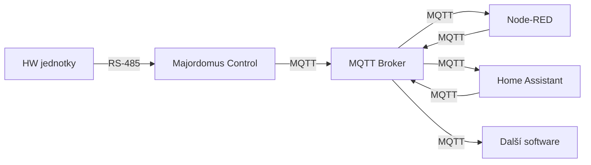

# Architektura software

Softwarová vrstva systému Majordomus běží na nízkoenergetickém počítači (typicky Raspberry Pi). Celý systém je navržen tak, aby byl spolehlivý, otevřený, snadno rozšiřitelný a **nezávislý na cloudu** — vše běží lokálně u vás doma.

---

## Majordomus Control

Jádro celého systému. Majordomus Control je most mezi fyzickým hardwarem a světem aplikací.

- Komunikuje přímo s HW jednotkami po sběrnici RS-485
- Překládá zprávy mezi jednotkami a **MQTT** protokolem
- Řídí konfiguraci, aktualizaci firmware a diagnostiku jednotek
- Poskytuje **webové rozhraní** pro konfiguraci a servis
- Běží na Raspberry Pi nebo jakémkoliv jiném PC s Linuxem/Windows

!!! info "Majordomus Control je jediný software, který potřebujete od Majordomu"
    Vše ostatní — MQTT broker, Node-RED, Home Assistant — jsou standardní open-source nástroje, které si nainstalujete sami podle svých potřeb.

---

## MQTT Broker

Komunikační páteř mezi Majordomus Control a všemi aplikacemi. Doporučujeme [Eclipse Mosquitto](https://mosquitto.org/) — lehký, spolehlivý a ověřený miliony instalací po celém světě.

- Slouží jako komunikační vrstva mezi Majordomus Control a aplikacemi třetích stran
- Umožňuje integraci s Home Assistant, Node-RED, openHAB a dalšími
- Standardní protokol — jakýkoliv software s podporou MQTT se dokáže připojit

---

## Aplikace pro automatizaci

Majordomus vám nediktuje, jaký software máte používat. Díky MQTT si zvolíte to, co vám vyhovuje:

### Node-RED

Vizuální programovací nástroj pro tvorbu automatizací. Ideální pro řízení klíčových funkcí domu — topení, osvětlení, žaluzie, ventilace. Logiku vytváříte přetahováním bloků, bez nutnosti psát kód.

### Home Assistant

Populární platforma pro chytrou domácnost. Slouží jako uživatelské rozhraní — mobilní aplikace, dashboardy, hlasové ovládání. Umožňuje také integraci s dalšími zařízeními mimo Majordomus (televize, FVE, elektromobil, meteostanice a stovky dalších).

### Jiný software

Díky otevřenému MQTT rozhraní můžete použít jakýkoliv systém, který MQTT podporuje — openHAB, Domoticz, vlastní skripty v Pythonu nebo cokoliv dalšího.

---

## Jak spolu jednotlivé vrstvy komunikují

Komunikace je **obousměrná** — aplikace čtou data ze senzorů (teplota, pohyb, stav tlačítka) a zároveň posílají příkazy zpět do systému (rozsvítit světlo, spustit žaluzii, přepnout relé).

