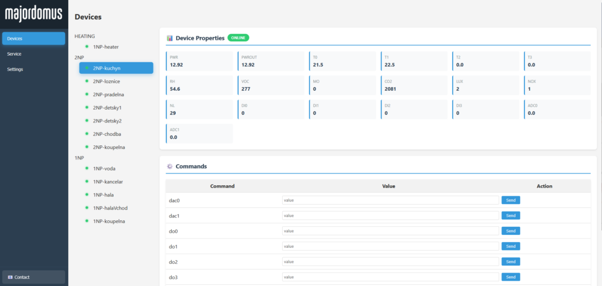

# Instalace software

Instalace je napsána pro mini PC Raspberry Pi s výchozím operačním systémem Raspberry Pi OS. Postup je ale stejný pro jakoukoliv distribuci založenou na Debianu (Ubuntu, Mint...).



---

## 1. Instalace MQTT brokeru (Mosquitto)

### Update systému

```bash
sudo apt update
sudo apt upgrade -y
```

### Instalace Mosquitto

```bash
sudo apt install -y mosquitto mosquitto-clients
```

### Povolení automatického spouštění

```bash
sudo systemctl enable mosquitto
sudo systemctl start mosquitto
```

### Konfigurace pro testování

Pro rychlé vyzkoušení stačí povolit anonymní přístup bez hesla. Otevřete konfigurační soubor:

```bash
sudo nano /etc/mosquitto/mosquitto.conf
```

Smažte obsah a nahraďte ho tímto:

```
persistence false
allow_anonymous true
listener 1883
```

Uložte (`Ctrl+O`, `Enter`, `Ctrl+X`) a restartujte službu:

```bash
sudo systemctl restart mosquitto.service
```

!!! warning "Pouze pro testování"
    Anonymní přístup bez hesla je vhodný jen pro první vyzkoušení na lokální síti. Pro reálné nasazení je nutné nastavit přihlašování jménem a heslem, případně šifrování komunikace pomocí TLS.

---

## 2. Instalace Majordomus Control

### Instalace Javy

Majordomus Control je napsaný v Javě. Nainstalujte JDK:

```bash
sudo apt install -y openjdk-25-jdk
```

### Stažení a rozbalení

```bash
mkdir -p ~/majordomus
cd ~/majordomus
wget https://github.com/jirihusak/majordomus/releases/latest/download/MajordomusControl.zip
sudo apt install -y unzip
unzip MajordomusControl.zip -d .
```

### Spuštění

```bash
chmod +x run.sh
./run.sh
```

Po spuštění by mělo být webové rozhraní dostupné na adrese `http://<IP_ADRESA>:8899`.

!!! tip "Jak zjistit IP adresu Raspberry Pi?"
    Zadejte v terminálu `hostname -I` — zobrazí se IP adresa vašeho zařízení v lokální síti.

---

## 3. Automatické spouštění po startu

Aby se Majordomus Control spustil automaticky po každém zapnutí nebo restartu Raspberry Pi, vytvořte systemd službu.

### Vytvoření souboru služby

```bash
sudo nano /etc/systemd/system/majordomus.service
```

### Obsah souboru

```ini
[Unit]
Description=Majordomus Control
After=network.target

[Service]
Type=simple
ExecStart=/home/pi/majordomus/run.sh
WorkingDirectory=/home/pi/majordomus
User=pi
Group=pi
Restart=on-failure

[Install]
WantedBy=multi-user.target
```

Uložte: `Ctrl+O`, `Enter`, `Ctrl+X`.

### Aktivace služby

```bash
sudo systemctl daemon-reload
sudo systemctl enable majordomus
sudo systemctl start majordomus
```

### Ověření

Otevřete v prohlížeči `http://<IP_ADRESA>:8899` — mělo by se zobrazit webové rozhraní Majordomus Control.

```bash
# Kontrola stavu služby
sudo systemctl status majordomus
```
