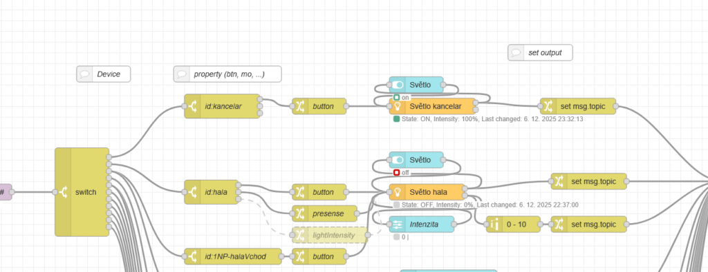

# Node-RED

## Co je Node-RED?

Node-RED je vizuální nástroj pro tvorbu automatizací a logiky pomocí takzvaných „flow" (toků). Místo klasického programování skládáte jednotlivé funkční bloky (uzly) graficky a propojujete je mezi sebou. Každý uzel má jasně danou funkci — může přijímat data ze senzorů, zpracovávat je, vyhodnocovat podmínky nebo ovládat výstupy.

Výsledek? Přehledné automatizace, které zvládnete vytvořit i bez programátorských zkušeností. A pokud programovat umíte, můžete v jednotlivých uzlech psát vlastní funkce v JavaScriptu.

Node-RED je open-source a zcela zdarma → [nodered.org](https://nodered.org/)



---

## Proč Node-RED v chytrém domě?

V rámci chytré domácnosti slouží Node-RED jako **centrální mozek automatizace**. Proudí do něj data ze senzorů — teplota, vlhkost, osvětlení, pohyb, spotřeby — a na jejich základě rozhoduje o akcích:

- Klesla teplota pod 20 °C? → Zapni topení.
- Nikdo není doma déle než 30 minut? → Zhasni všechna světla.
- Vlhkost v koupelně přesáhla 80 %? → Spusť ventilaci.
- Otevřelo se okno? → Vypni topení v dané místnosti.
- CO₂ přesáhl 1000 ppm? → Otevři rekuperaci.

Velkou výhodou je možnost snadno propojit různé technologie a protokoly (MQTT, HTTP, databáze, cloudové služby) na jednom místě.

---

## Node-RED a Majordomus

V systému Majordomus má každý nástroj svou roli:

- **Majordomus Control** zajišťuje spolehlivý sběr a řízení dat na úrovni hardwaru.
- **Node-RED** přebírá tato data a přidává jim smysl — propojuje informace ze senzorů s akcemi, přizpůsobuje chování domu konkrétním potřebám uživatele.

Automatizace tak můžete postupně rozšiřovat, upravovat a ladit **bez zásahu do firmware zařízení**. Přidáte nový senzor? Stačí přidat pár uzlů do flow. Chcete změnit logiku topení? Přepojíte bloky v prohlížeči. Žádné překládání kódu, žádné nahrávání firmware.

!!! tip "Deploy jedním kliknutím"
    Rozhraní Node-RED běží jako webová služba v prohlížeči. Změny v programu se nasadí kliknutím na tlačítko **Deploy** — okamžitě, bez restartu, bez složitého překládání a nahrávání.

---

## Instalace Node-RED

Na Raspberry Pi s Raspberry Pi OS:

```bash
bash <(curl -sL https://raw.githubusercontent.com/node-red/linux-installers/master/deb/update-nodejs-and-nodered)
```

Povolení automatického spouštění:

```bash
sudo systemctl enable nodered.service
sudo systemctl start nodered.service
```

Rozhraní bude dostupné na `http://<IP_ADRESA>:1880`.

