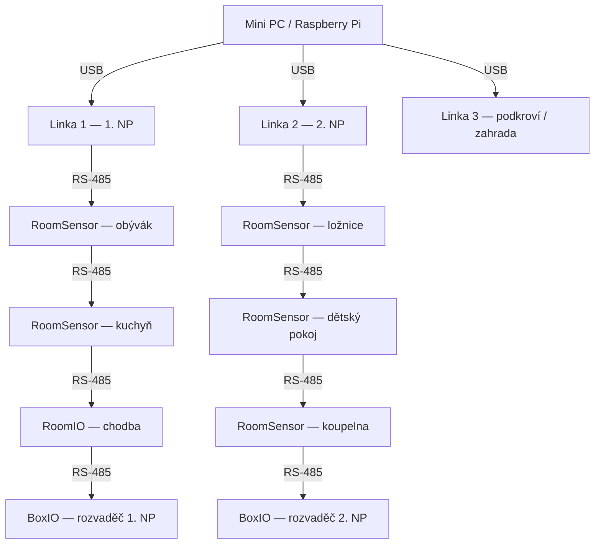

# Topologie systému
 
Základem je jeden hlavní počítač (např. Raspberry Pi), ke kterému jsou přes USB připojeny RS485 převodníky. Každý převodník obsluhuje jednu **linku** — sběrnici, na které visí zařízení v dané části domu.
 
Typické rozložení pro rodinný dům:
 

 
Doporučujeme **jednu linku na patro** (nebo logickou zónu — zahrada, garáž, dílna). Na každé lince může být přibližně **10–15 zařízení**. Tento limit není technický, ale praktický — zajišťuje rychlou odezvu tlačítek a spínačů.
 
---
 
## Kabeláž
 
### Doporučený kabel
 
Sběrnice RS485 využívá standardní ethernetový kabel, který je levný, všude dostupný a snadno se s ním pracuje:
 
- **Typ:** UTP-S (stíněný) nebo UTP-F (fóliově stíněný), kategorie Cat5e nebo Cat6
- **Provedení:** doporučujeme **lanko** (flexible), ne drát (solid) — snadnější manipulace v instalačních krabicích

### Zapojení vodičů
 
UTP kabel má 8 vodičů, vždy 2 vodiče tvoří barevný pár. Vodiče zdvojíme podle barev a využijeme 4 páry:
 
| Signál | Barva vodiče | Popis |
|---|---|---|
| **+12 V** | oranžový pár | Napájení zařízení |
| **GND** | modrý pár | Zem |
| **A** | zelený pár | RS485 datový vodič A |
| **B** | hnědý pár | RS485 datový vodič B |
 
!!! tip "Proč zrovna tyto barvy?"
    Barevné přiřazení vychází ze standardního značení UTP kabelů a je jednotné napříč celým systémem Majordomus. Díky tomu se při zapojování nemůžete splést — a pokud vám někdy bude zapojení dělat někdo jiný, okamžitě se zorientuje.
 
### Maximální délka linky
 
Sběrnice RS485 při komunikační rychlosti 115 200 Bd zvládne teoreticky až **1 000 m** v ideálních podmínkách. Pro běžné domácí instalace doporučujeme:
 
- **Do 200 m na linku** — spolehlivý provoz bez kompromisů

---
 
## Napájení
 
Všechna zařízení na sběrnici se napájí přímo z linky napětím **12 V DC**. Stačí jeden zdroj na celý systém.
 
- **Standardní instalace:** 12V spínaný zdroj s dostatečným výkonem pro všechna zařízení na lince (např. 25W - 75W)
- **Instalace s UPS:** zdroj s akumulátorovou zálohou na napětí **13,8 V** — systém běží i při výpadku elektřiny
 
---